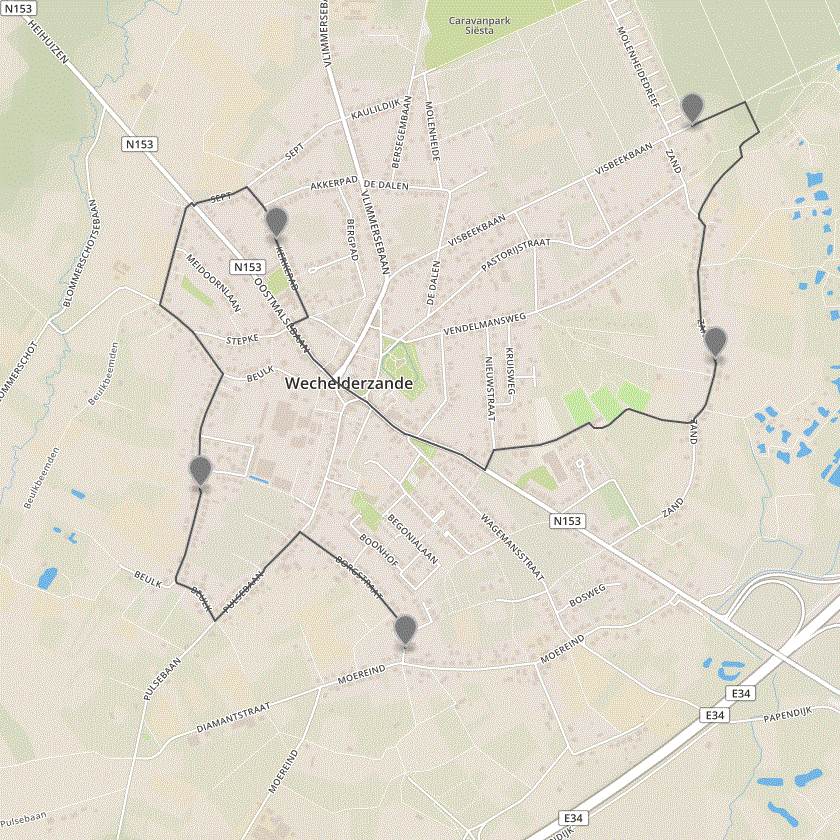

Itinero.Optimization
--------------------

A module for solving optimization routing problems with Itinero as a routing solution.

/statusIcon)

- Itinero.Optimization:    

### Supported problems

Current we have the following problems supported:

- TSP: The default travelling salesman problem.
- Directed TSP: The TSP with costs for turns.
- TSP-TW: The TSP with time window constraints.
- Directed TSP-TW: The TSP-TW with costs for turns.
- STSP: The selective travelling salesman problem, generates routes with as much locations as possible with a maxium travel time.
- DirectedSTSP: Identical to the STSP but with u-turn prevention.

### Usage

Install the following package via Nuget:

    PM> Install-Package Itinero.Optimization -IncludePrerelease

Then immidiately some extension methods are available on top the default Itinero _Router_ class. For each method there is a Try alternative that doesn't raise any exceptions when something goes wrong but gracefully reports on the error(s).

- CalculateTSP (profile, locations, first, last): Calculates a default TSP.
  - profile: The vehicle profile.
  - locations: The locations.
  - first: The location to start at.
  - last (option): The location to end up at, when last=first the route will be a loop.
- CalculateTSPDirected (profile, locations, turnPenaltyInSeconds, first, last): Calculates a default TSP with u-turn costs.
  - profile: The vehicle profile.
  - locations: The locations.
  - turnPenaltyInSeconds: Turn penalty in seconds.
  - first: The location to start at.
  - last (option): The location to end up at, when last=first the route will be a loop.
- CalculateTSPTW (profile, locations, windows, first, last): Calculates a TSP with time windows.
  - profile: The vehicle profile.
  - locations: The locations.
  - windows: The time window constraints.
  - first: The location to start at.
  - last (option): The location to end up at, when last=first the route will be a loop.
- CalculateTSPTWDirected  (profile, locations, windows, turnPenaltyInSeconds, first, last)
  - profile: The vehicle profile.
  - locations: The locations.
  - windows: The time window constraints.
  - turnPenaltyInSeconds: Turn penalty in seconds.
  - first: The location to start at.
  - last (option): The location to end up at, when last=first the route will be a loop.
- CalculateSTSP (profile, locations, max, first, last): Calculate a STPS solution.
  - profile: The vehicle profile.
  - locations: The locations.
  - max: The maximum travel time of a tour.
  - first: The location to start at.
  - last (option): The location to end up at, when last=first the route will be a loop.
- CalculateSTSPDirected (profile, locations, turnPenaltyInSeconds, max, first, last): Calculate a directed STPS solution.
  - profile: The vehicle profile.
  - locations: The locations.
  - turnPenaltyInSeconds: Turn penalty in seconds.
  - max: The maximum travel time of a tour.
  - first: The location to start at.
  - last (option): The location to end up at, when last=first the route will be a loop.
  

  
